## 🌐 Arquitectura de Red del Laboratorio TI

La infraestructura que he implementado se compone de un servidor Windows Server 2019, un firewall virtualizado y varios clientes Windows, todos integrados en un dominio corporativo.

### 🔹 Componentes principales

## Firewall (10.10.10.1)

Interfaz WAN: salida a Internet mediante NAT.

Interfaz LAN: red interna 10.10.10.0/24 (funciona como gateway predeterminada para toda la red)

## Windows Server (10.10.10.2)

### Controlador de Dominio y DNS para gestión centralizada de usuarios y equipos.

Para la correcta configuración del DNS es necesario: 
1. instalar Active Directory Domain Services en el servidor. 

2. Promover el servidor a controlador de dominio (en este caso AKEY.domain) 

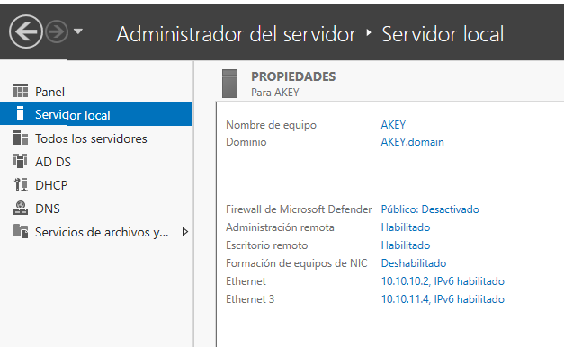

Una vez hecho esto, se debe unir el equipo cliente al dominio.

   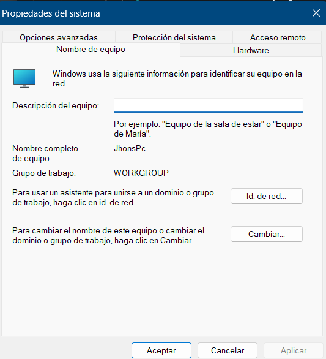
   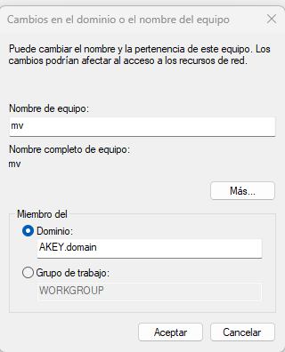

 

 Y de esta manera podremos iniciar sesión en cualquier usuario que haya sido creado en el servidor usando la misma maquina o terminal. 

  # 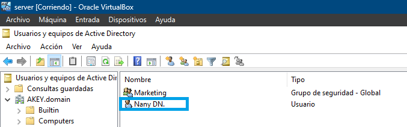
    
  # 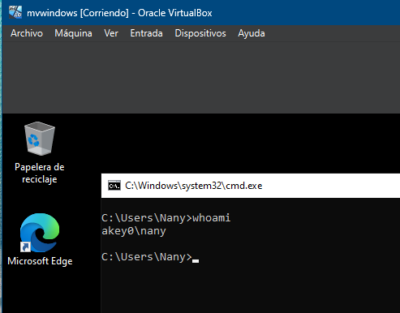
   
  # 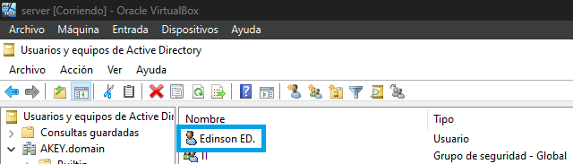
   
  # 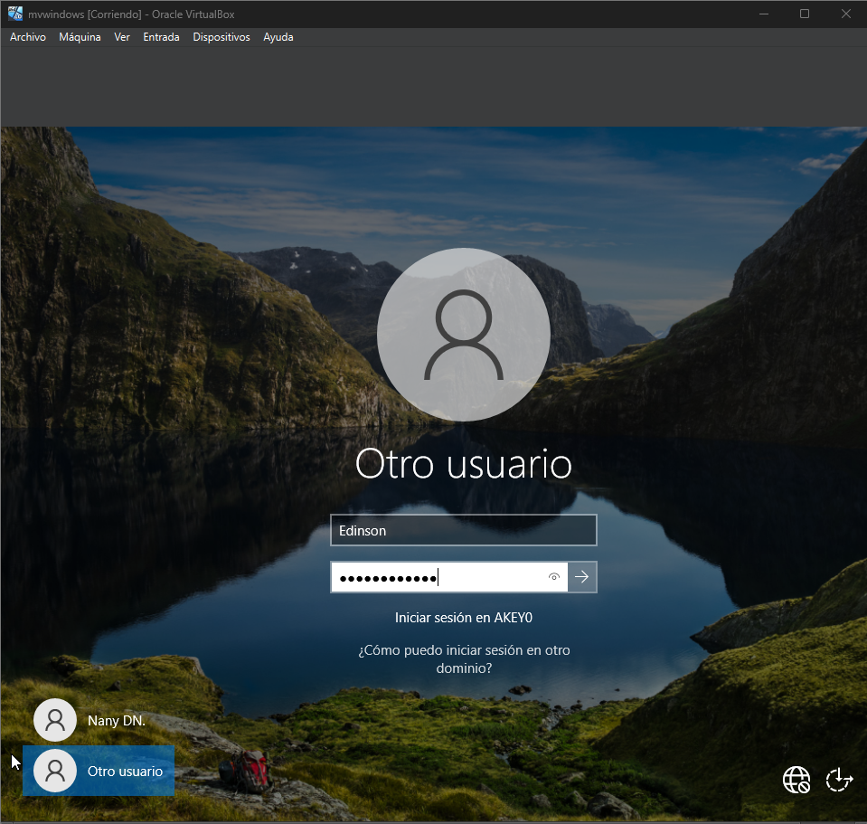
   
  # 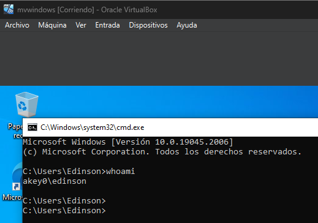

Y tambien podemos comprobar que el servidor resuelve los nombres internos desde el equipo cliente con el comando nslookup + nombre del servidor.

# 

### DHCP: 
Asignación automática de IPs. 
#### Para configuar DHCP en nuestro servidor debemos: 
   1.Instalar el rol DCHP

   # 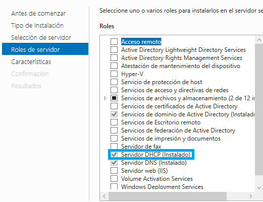

   2. Crear un ambito, en cual se especificará el rango de IPs que se quiere usar en este caso usare desde la 10.10.10.100 hasta la 10.10.10.200:

   # 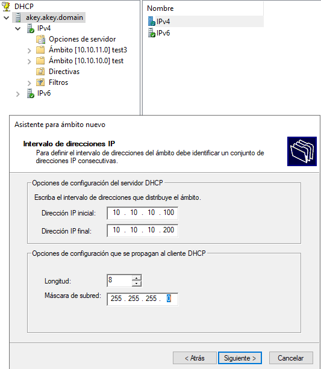

   3. Autorizar el servidor para que provea servicio DHCP; de lo contrario no funcionará: 

   En este caso yo ya le he dado a autorizar.

   # 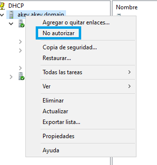

#### Prueba de asignación automatica de IPs desde una máquina cliente: 

Podemos ver que recibe la IP dentro del rango que se ha establecido 10.10.10.100-200 y en este caso ha recibido la IP 10.10.10.100

# 

### File Server: 
Almacenamiento centralizado de datos y archivos dentro de la red, permitiendo a los usuarios autorizados acceder, gestionar y compartir esa información de manera remota y eficiente.

Y tambien se configuro una GPO para que al iniciar sesión en cada usuario, la unidad de red para el servicio de archivos compartidos seimpre este disponible.

---

##🔹 Flujo de comunicación

Los clientes reciben su configuración IP vía DHCP del Windows Server.
El gateway predeterminado (10.10.10.1) apunta al firewall, que se encarga de enrutar y aplicar políticas.
Las consultas de nombres se envían al DNS del Server (10.10.10.2), que resuelve nombres internos y reenvía las externas a Internet.
El firewall hace NAT y permite la salida a Internet de los clientes y del servidor.
Los usuarios acceden a recursos compartidos (ej: \\Servidor\Marketing) y a servicios del dominio.

