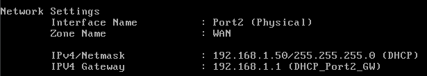
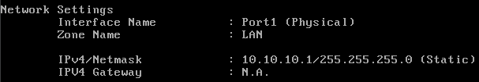
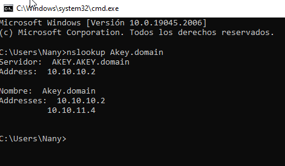
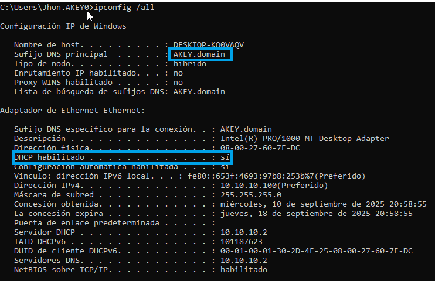
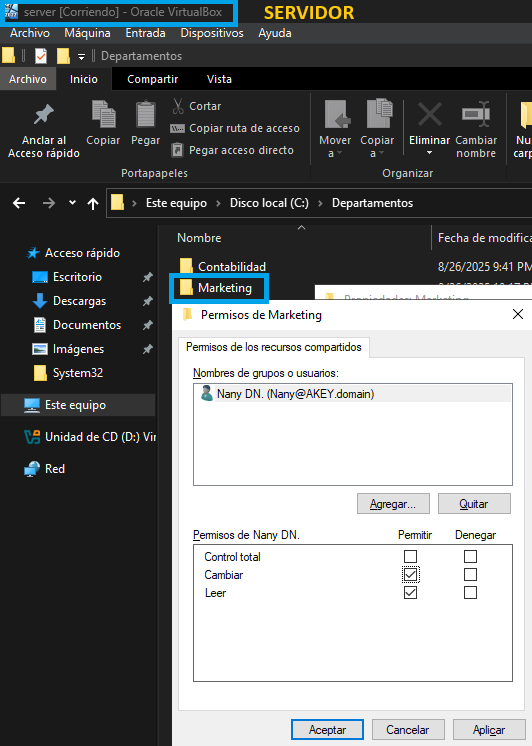
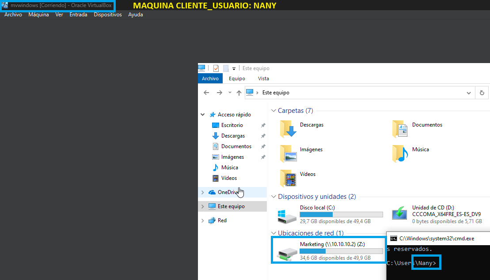

## 🌐 Arquitectura de Red del Laboratorio TI

La infraestructura implementada se compone de un servidor Windows Server 2019/2022, un firewall virtualizado y varios clientes Windows, todos integrados en un dominio corporativo.

### 🔹 Componentes principales

#### Firewall (10.10.10.1)

Interfaz WAN: salida a Internet mediante NAT.

  
  
  

Interfaz LAN: red interna 10.10.10.0/24 (funciona como gateway predeterminada para toda la red)

#### Windows Server (10.10.10.2)

Controlador de Dominio (AD DS): gestión centralizada de usuarios y equipos.

DNS: resolución de nombres internos y reenvío a Internet.
Para comprobar que el servicio DNS esta correctamente configurado lo hacemos con el comando PING + Nombre del sevidor  desde un equipo cliente. 

DHCP: asignación automática de IPs dentro del rango 10.10.10.100 – 10.10.10.200.

File Server: carpetas compartidas con permisos por departamento.

Clientes Windows (10.10.10.101, 10.10.10.102, …)

Se unen al dominio corporativo.

Obtienen su configuración (IP, Gateway, DNS) desde el servidor DHCP.

Acceden a recursos de red (carpetas compartidas, impresoras, políticas de grupo).

Internet

Acceso disponible para todos los clientes a través del firewall.

---

##🔹 Flujo de comunicación

Los clientes reciben su configuración IP vía DHCP del Windows Server.

El gateway predeterminado (10.10.10.1) apunta al firewall, que se encarga de enrutar y aplicar políticas.

Las consultas de nombres se envían al DNS del Server (10.10.10.2), que resuelve nombres internos y reenvía las externas a Internet.

El firewall hace NAT y permite la salida a Internet de los clientes y del servidor.

Los usuarios acceden a recursos compartidos (ej: \\Servidor\Marketing) y a servicios del dominio.

---

##🔹 Diagrama de Red
   

##✅ Estado actual del laboratorio

Dominio corporativo en funcionamiento.

DHCP y DNS configurados.

Clientes unidos al dominio.

Carpetas compartidas con permisos por UO.

Acceso a Internet desde los clientes mediante firewall.
