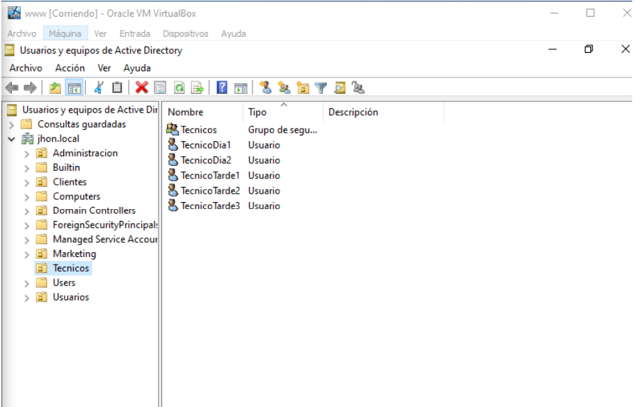
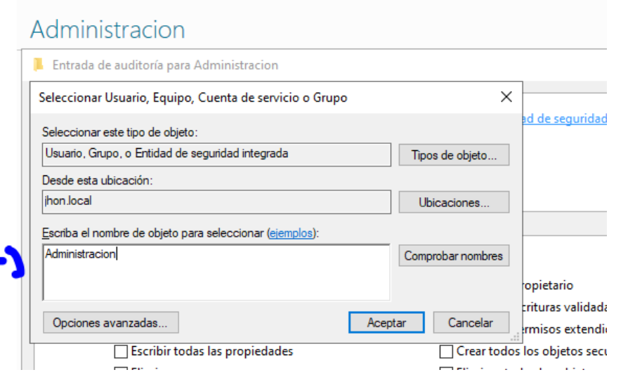
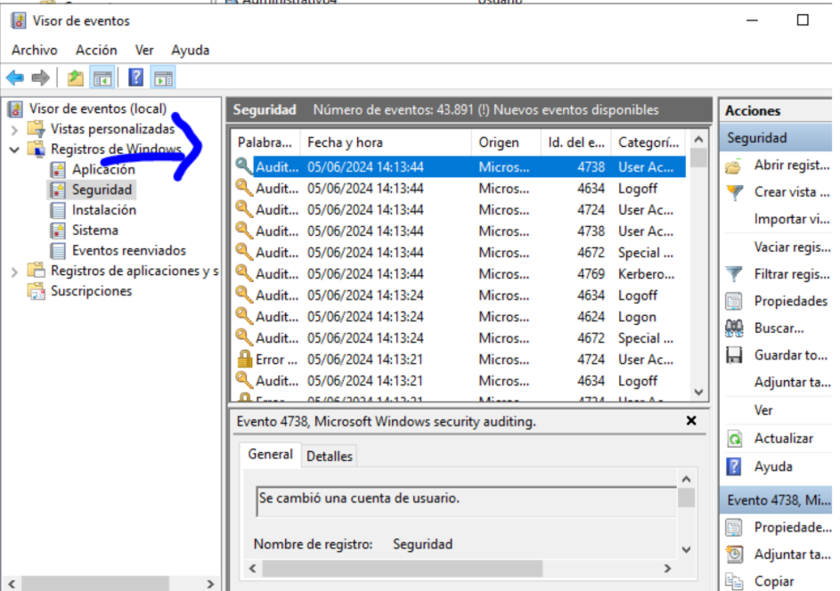

# 🛡️ Auditorías en Active Directory con Windows Server

Este proyecto demuestra cómo implementar políticas de auditoría dentro de un entorno de Active Directory para monitorizar eventos críticos como inicios de sesión, cambios de cuenta, accesos a objetos y uso de permisos.

---

## 🎯 Objetivo

Aplicar auditorías por unidad organizativa (UO) usando directivas de grupo (GPO) específicas, permitiendo registrar eventos relevantes para el control de seguridad y la trazabilidad en el dominio.

---

## 🧩 Auditorías por UO

| Unidad Organizativa | Auditorías aplicadas |
|---------------------|----------------------|
| **Técnicos**        | Inicios de sesión, cambios de cuenta, cambios en políticas |
| **Marketing**       | Inicios de sesión, accesos a objetos, uso de permisos, eventos de sistema |
| **Administración**  | Inicios de sesión, accesos a objetos, uso de permisos |
| **Clientes**        | Inicios de sesión, accesos a objetos, seguimiento de procesos, cierres de sesión |

---

## 🖥️ Herramientas utilizadas

- Windows Server 2019
- Active Directory
- Group Policy Management
- Event Viewer (`eventvwr.msc`)

---

## 🛠️ Proceso resumido

1. Crear políticas de grupo nuevas para cada UO.
2. Habilitar auditorías específicas en cada una según su perfil.
3. Aplicar la GPO a la UO correspondiente.
4. Generar eventos (ej: cambio de contraseña, acceso a recurso).
5. Visualizar registros en el Visor de eventos.

---

## 🖼️ Capturas de configuración y resultados

### 👥 Usuarios en Active Directory

### 📌 Configuración de GPO

## Cambio de contraseña

### 📋 Evento registrado tras cambio de contraseña

---

## ✅ Conclusión

Esta práctica permitió configurar auditorías detalladas en un entorno de Active Directory, asignando políticas de seguridad específicas a cada unidad organizativa. A través del visor de eventos, se verificó que los sucesos como inicios de sesión, cambios de cuentas y accesos a objetos eran correctamente registrados.

Puedes ver la memoria técnica completa del proyecto aquí:  
➡️ [Ver documento (PDF en Google Drive)](https://drive.google.com/file/d/1udQqrMX-SBk-Ce1qysCr_a6Z9HGydLcl/view?usp=sharing)

